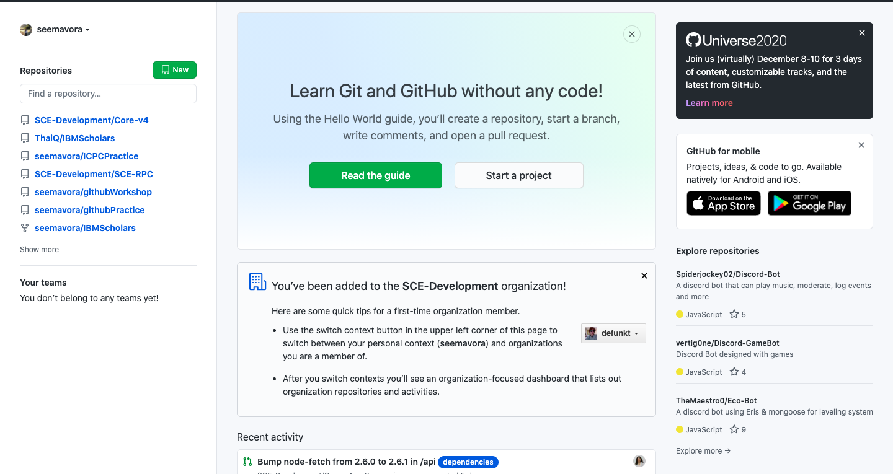
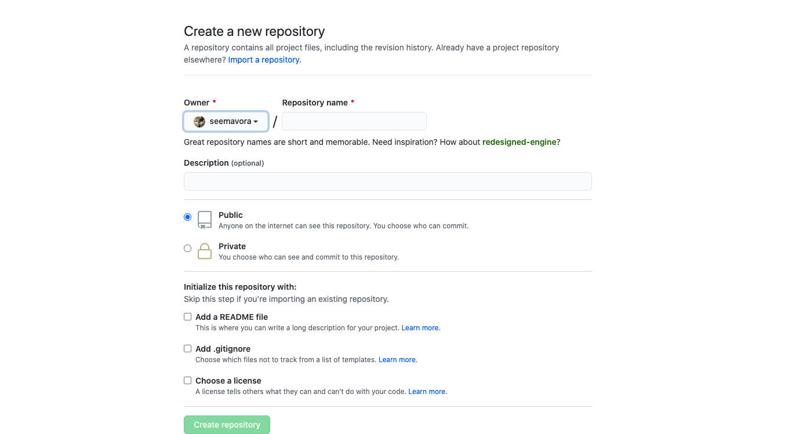
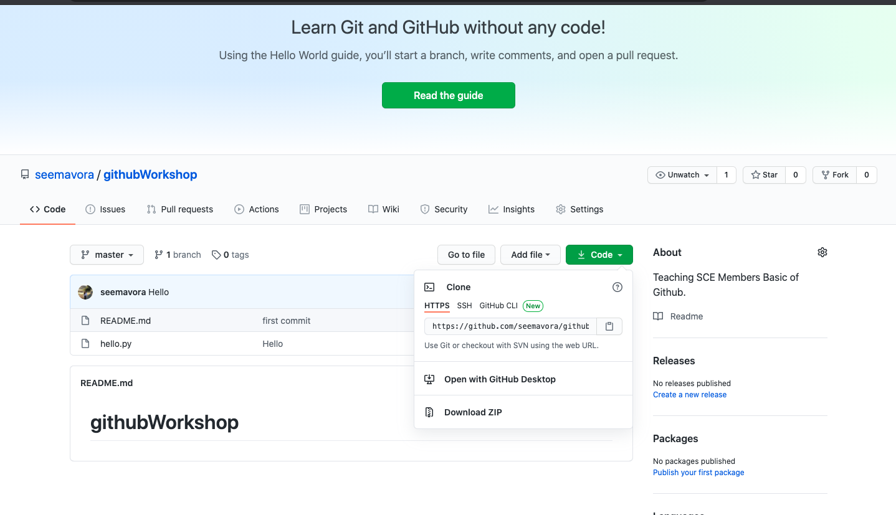
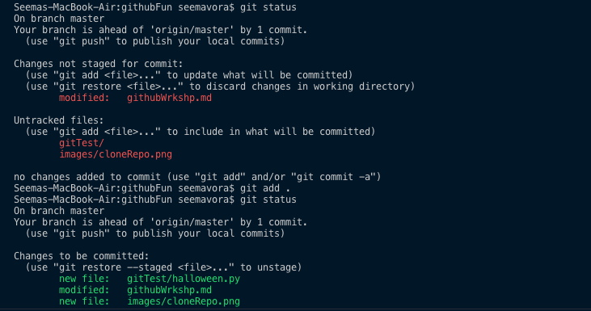
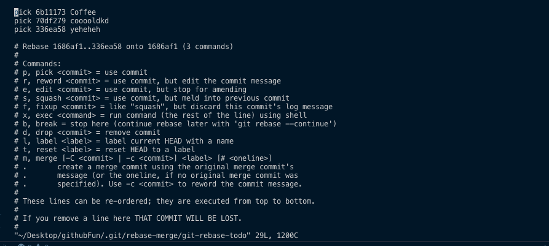
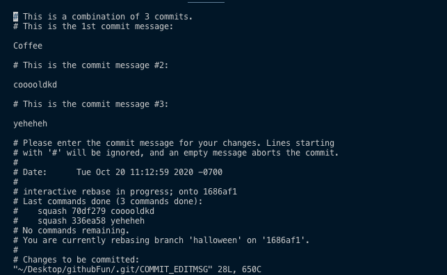

># Github Basics Workshop

## Things we will go over:
-  Making a Repo
- Cloning a Repo
- Branches
-  ADD, COMMIT, PUSH, PULL
- Squashing Commits

## Making a Repo
**STEP 1** 

Click on the New button on the left-hand side

**STEP 2**

Fill in desired info! And your repo has been created! 

## Cloning a Repo
**STEP 1** 

Click on the code button and copy the link. Once the link is copied, go to the terminal of your choice and cd into the directory in which you wish to clone your repo. 


**STEP 2**
In your terminal type in the following command:

``` git clone https://github.com/seemavora/githubWorkshop.git ```   
Replace the link with the link you copied in Step 1. (For this workshop simply copy paste this command.) 

## Basic Git Commands
### **The Best Git Command to Exist**
- ```git status``` : When in doubt use this command, will give you hints on what you should do next.

### **Github Branches**

- ```git branch``` : Checks what branch you are on and the history of branches you have checked out in the past. The main branch is by default named master. 

*For Dev Team Members: The roote branch for Core-V4 is dev, NEVER EVER WORK ON THIS BRANCH!!!*

- ``` git checkout -b <branch> ``` Creates new branch.

- ``` git checkout <branch> ``` Allows you to work on this branch

- ``` git fetch origin <branch>``` Updates branch of all recent commits. 


### **ADD, COMMIT, PUSH, PULL**
**Step 1** Adding Your Changes

- ```git add .``` : Stages all your files for commit

- ``` git add <file>``` Stages a particular file for commit




**Step 2** Commiting Your Changes

- ```git commit -m 'message'``` : Commiting your changes with a specific message.

- ``` git commit --amend --no-edit``` Commiting changes without changing your previous commit message.

*In the case that you enter VIM while trying to commit:*
- MAC USERS: press esc follwed by :wq

**Step 3** Pushing Your Changes

- ```git push origin <branch>'``` : Pushes the changes you made on your branch. 

- ``` git push --force origin <branch>``` Force pushes the changes.
- ``` git pull origin <branch>``` Pulls the changes you just made. 

*Once your branch has been merged into the repository, make sure to start a new project with  NEW BRANCH!*

### **Resetting Branch to Github Branch**

- ``` git pull origin <branch>``` Pulls the changes you just made. 
- ``` git reset --hard origin/<branch>``` Resets branch to what was last committed to Github.  

### **Squashing Commits**

STEP 1:  ``` git rebase -i master``` Starts the squashing process.

STEP 2: You should have entered vim. Press 'i' in order to insert or type into VIM except the first . You should see something like this: 


STEP 3: Change all the commits below the first one to say either 's' or squash, instead of pick. Leave the first one to say pick! 

STEP 4: After your done exit out of VIM.

STEP 5: You should enter a history of all the past commit messages. (Make sure your commit messages are informational, not like the ones shown in the image!) In VIM press 'dd' in order to delete all the past commits and leave it to have one useful commit message, once you are done exit VIM again. 



*Sometimes you will be asked to do these steps multiple times, that is normal*

Step 6: ```git push origin <branch> --force```

STEP 7: Check Github and make sure your branch only shows one commit, if not repeat the steps.


###### Created by Seema Vora 


